# Consultation analysis: a production architecture

Thomas Butler

One central service that turns a department's consultation responses into signed-off themes and a filterable dashboard.

## Diagram 1: the journey and the system

*Diagram 1. One database holds every fact and job; response text leaves it only for the model gateway; reviewers sign off before tagging; and each email is written in the commit that earns it.*

## Diagram 2: one open question's life

*Diagram 2. Each question runs, fails and retries alone; the worker that finishes the last question of a phase flips the consultation and queues its email in the same commit.*

## The design, in bullets

- Configuration lives in the app, not the workbook: an option with a comma can't be written in a comma-joined cell, so the workbook pre-fills a form, a person resolves its warnings, and what '-' and 'N/A' mean is recorded per question. The upload is validated and costed before anything is spent, and no demographic reaches a prompt.
- A named reviewer signs off each question's themes before any response is tagged, and the server enforces it; every edit is kept as evaluation data. A department publishes these themes, so someone has to own each list, and i.AI's own evaluation still saw reviewers change one mapping in four.
- Postgres holds every fact and all pipeline state; S3 holds only uploads and exports; queue messages are hints, so a duplicate or a lost one is harmless. One job per open question, with a lease, a fencing token and a checkpoint per batch: a dead worker's job resumes and a zombie can't write. The worker finishing the last question of a phase flips the consultation and queues the email in one commit; one finisher wins, and the reconciler covers a crash.
- One answer row per respondent, question and option, plus a respondent snapshot, so 'villagers who cycle to work and oppose' is one query on two indexes: the plan is proved at 20,000 rows, and the largest consultations, five times that, are still to be measured. Tags are never deleted and theme lists are versioned, so counts reproduce.
- Responses are untrusted input: no tools, answers sent as JSON data, labels an enum of theme keys, small batches to bound the blast radius. Containment first: a planted theme still has to pass the reviewer.
- Stored and encrypted at rest in London. Only the question, the open answer, any linked closed answer and the theme list reach the model, through a gateway. The costed model tier may run inference outside the UK, which GDS guidance allows for OFFICIAL, so every job records its inference region for the department's DPIA; a UK-only tier costs more.
- Parity first, with the manual process alongside and pilot consultations replayed as the gate. Then sign-off and the dashboard, then self-serve behind department caps. Three engineers, with design and research part-time, for two quarters.
- Model spend is small beside reviewer time: £240 of model time against 22 hours of expert checking for 50,000 responses (DSIT and Defra, 16 October 2025). Throughput and sign-off time bind. Cost is a guard: an estimate before a run, which is built, and a department budget, which is designed.
- One service for every department: scoped at every query, served fairly under per-department caps, with a processor agreement and a manifest per run that pre-fills the DPIA. At the assumed gateway share, themes for 100,000 respondents are ready in about two and a half hours and the run in about six; that wait moves with the share, not the code. Before go-live: an ATRS record and WCAG 2.2 AA.
- Least sure, so I'd test first: the dashboard's query plan under a selective filter on the largest consultations, and whether per-question sign-off is bearable at dozens of questions.

I read i.AI's public repository and decision records before designing; the shape follows their 0007 and 0008, and where 'every department' changes the problem I've gone further: configuration in the app, sign-off per question, the fan-in and the email in one commit.

This goes further than the brief asked, because for a government service the foundations are where the judgement shows. These three pages are the answer; the repository at github.com/ThomasJButler/consultation-architecture is the working, and docs/02 sections 2 and 7 with poc/TESTING.md are the ten-minute path.

---

I used Claude throughout: to research, to stress-test alternatives, to draft the diagrams and, under rules I set and a review pass before every merge, to write most of the proof-of-concept's code and tests. The choices are mine.
